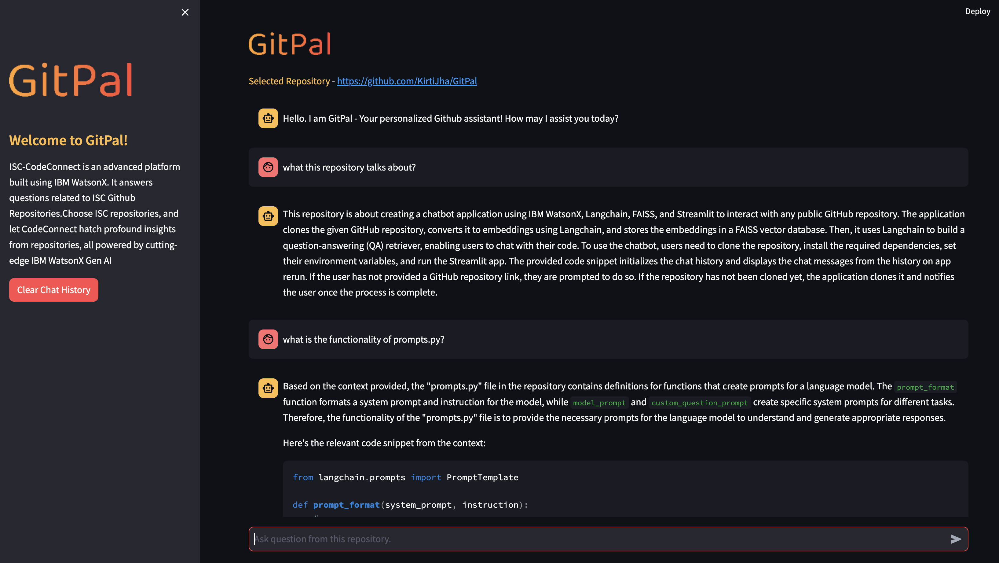

<div align="left">
  
</div>

## GitPal: Chat with Github Repository using IBM WatsonX, Langchain, FAISS and Streamlit (RAG)

This project facilitates conversational interaction with any public GitHub repository utilizing advanced technologies such as IBM WatsonX, Langchain, FAISS vector database, and Streamlit. It operates as an RAG (Retrieval Augmented Generation) application, enhancing the user experience with efficient code exploration and understanding.

## Features

- **IBM WatsonX Integration**: Users input their IBM WatsonX API Key along with the GitHub Repository link.
- **Repository Cloning and Chunking:** The specified repository is cloned locally and segmented into manageable chunks for processing.
- **Embedding Conversion:** Utilizing Langchain, the code segments are transformed into embeddings.
- **FAISS Vector Database:** The embeddings are stored in a FAISS vector database for efficient retrieval and querying.
- **QA Retriever:** Langchain constructs a QA retriever, enabling users to engage in conversational queries related to their code.

## GitPal User Interface

<div align="center">
  
</div>

## Getting Started

1. Clone the repository:

```
git clone https://github.com/IBM/gitpal-watsonx-ai-github-chatbot.git
cd <your_project_directory>
```

2. Create a new virtual environment using a tool like virtualenv or conda, and activate the environment:

```
python3 -m venv <name_of_virtual_env>
source /venv/bin/activate
```

3. Install dependencies:

```
pip install -r requirements.txt
```

3. Run the Streamlit app:

```
streamlit run chatbot.py
```

5. Access the chat interface:

Open your web browser and navigate to http://localhost:8501.

- Input your IBM WatsonX API key and the name of your GitHub repository.
- Engage with the chatbot by asking questions or providing instructions using natural language.

### Limitations

- Language Model Dependency: The chatbot's performance is contingent upon the accuracy and capabilities of the underlying language model.
- Processing Time: Large codebases or repositories with intricate structures may incur longer processing times for chunking and embedding.
- Response Quality: The accuracy and quality of responses are influenced by both the language model's accuracy and the effectiveness of code embeddings.

### Run App with Streamlit Cloud

[Launch App on Streamlit](https://gitpal.streamlit.app/)

Feel free to contribute, provide feedback, or report issues via GitHub. Your contributions are valued and help enhance the functionality and usability of this project.
